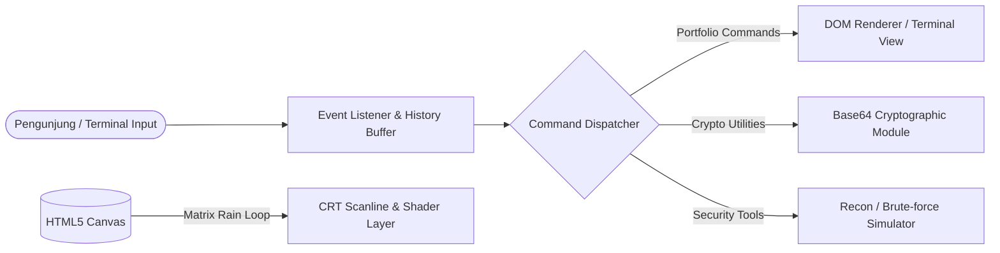

<div align="center">

```text
  ██╗  ██╗ █████╗  ██████╗██╗  ██╗███████╗██████╗     ████████╗███████╗██████╗ ███╗   ███╗
  ██║  ██║██╔══██╗██╔════╝██║ ██╔╝██╔════╝██╔══██╗    ╚══██╔══╝██╔════╝██╔══██╗████╗ ████║
  ███████║███████║██║     █████═╝ █████╗  ██████╔╝       ██║   █████╗  ██████╔╝██╔████╔██║
  ██╔══██║██╔══██║██║     ██╔═██╗ ██╔══╝  ██╔══██╗       ██║   ██╔══╝  ██╔══██╗██║╚██╔╝██║
  ██║  ██║██║  ██║╚██████╗██║ ╚██╗███████╗██║  ██║       ██║   ███████╗██║  ██║██║ ╚═╝ ██║
  ╚═╝  ╚═╝╚═╝  ╚═╝ ╚═════╝╚═╝  ╚═╝╚══════╝╚═╝  ╚═╝       ╚═╝   ╚══════╝╚═╝  ╚═╝╚═╝     ╚═╝
            [ Web-Based Interactive Ethical Hacker Portfolio CLI ]
```

### ⚡ *Immersive Cyberpunk Command-Line Portfolio & Penetration Testing Simulator* ⚡

[](https://kenkaiken67.github.io/etichal_hacker_fun/)
[](https://developer.mozilla.org/en-US/docs/Web/HTML)
[](https://developer.mozilla.org/en-US/docs/Web/CSS)
[](https://developer.mozilla.org/en-US/docs/Web/JavaScript)
[](https://github.com/kenkaiken67)
[](LICENSE)

<br/>

[🌐 **Jelajahi Demo Langsung**](https://kenkaiken67.github.io/etichal_hacker_fun/) • [✨ **Fitur Unggulan**](#-fitur-utama) • [⌨️ **Daftar Perintah**](#-cheatsheet-perintah-terminal) • [🚀 **Instalasi Cepat**](#-panduan-instalasi--menjalankan)

---

</div>

## 📌 Sekilas Tentang Proyek

Selamat datang di **Web-Based Ethical Hacker Terminal**! 

Website ini merevolusi format portofolio konvensional yang kaku menjadi **pengalaman interaktif berbasis *Command Line Interface* (CLI)** bertema *cyberpunk/retro terminal*. Dibangun khusus untuk memamerkan keahlian dan identitas di bidang **Cyber Security** dan **Software Engineering**, platform ini memberikan sensasi nyata mengoperasikan konsol keamanan Linux langsung dari web browser tanpa instalasi backend apa pun.

```bash
guest@terminal:~$ help
Available commands: about, skills, projects, dirb, jtr, encode, decode, matrix, clear...

guest@terminal:~$ whoami
[+] Identity: Ethical Hacker & Software Engineer
[+] Mission : Securing perimeters, discovering vulnerabilities, and building robust code.

guest@terminal:~$ dirb https://target.local
[*] Probing endpoints...
  ==> DIRECTORY: /admin [403 Forbidden]
  ==> EXPOSED  : /config.env [200 OK - CRITICAL EXPOSURE]
  ==> DIRECTORY: /api/v1/auth [200 OK]

guest@terminal:~$ encode base64 "HackerMindset"
[+] Base64 Encoded: SGFja2VyTWluZHNldA==
```

---

## ⚡ Fitur Utama (Core Features)

| Ikon | Fitur | Keterangan Teknis |
| :---: | :--- | :--- |
| 💻 | **Pure CLI Interaction** | Sistem navigasi full-keyboard yang meniru terminal Unix/Linux native, mengeliminasi kebutuhan klik mouse. |
| 🔐 | **Live Cryptographic Engine** | Eksekusi encoding & decoding teks (Base64) secara instan via modul JavaScript tanpa request server. |
| 🛡️ | **SecTools Simulator** | Simulasi realistis alat audit & penetration testing kenamaan seperti `dirb` (Web Content Scanner) dan `jtr` (John the Ripper Hash Cracker). |
| 📜 | **Smart Command History** | Fitur buffer memory riwayat perintah menggunakan tombol panah **`↑` (Up)** dan **`↓` (Down)** layaknya Bash/Zsh. |
| 🌧️ | **Matrix Digital Rain & CRT Shader** | Animasi hujan kode dinamis berbasis **HTML5 Canvas** dipadu efek visual retro *scanlines*, *glow phosphor*, dan *flicker*. |
| ⚡ | **Zero Dependencies / Pure Vanilla** | Super ringan (<100KB), bebas runtime framework berat (No React, No jQuery), memuat secepat kilat (*sub-second load time*). |
| 📱 | **Responsive Adaptive Terminal** | Tampilan tetap optimal diakses dari layar desktop resolusi tinggi hingga layar smartphone. |

---

## ⌨️ Cheatsheet Perintah Terminal

Berikut adalah daftar perintah interaktif yang dapat dicoba langsung di dalam terminal:

### 🔍 Navigasi & Informasi Portofolio
| Perintah | Argumen | Fungsi |
| :--- | :--- | :--- |
| `help` | *-* | Menampilkan panduan dan daftar semua perintah yang tersedia |
| `about` | *-* | Menampilkan profil singkat, filosofi, dan latar belakang pengembang |
| `skills` | *-* | Menampilkan daftar keahlian (*technical stack*, tools *pentest*, bahasa pemrograman) |
| `projects` | *-* | Menampilkan portofolio proyek *cyber security* dan *software engineering* |
| `contact` | *-* | Menampilkan informasi kontak, media sosial, dan repositori profil |
| `clear` / `cls` | *-* | Membersihkan layar konsol terminal |

### 🛠️ Utilitas Kriptografi & Simulasi Pentest
| Perintah | Sintaks Contoh | Output / Reaksi Sistem |
| :--- | :--- | :--- |
| `encode` | `encode base64 "teks rahasia"` | Mengubah string teks menjadi representasi Base64 |
| `decode` | `decode base64 "dGVrcw=="` | Menerjemahkan kembali hash/string Base64 ke teks biasa |
| `dirb` | `dirb <url-target>` | Mensimulasikan *directory bruteforce scanning* pada target web |
| `jtr` | `jtr <hash>` | Mensimulasikan *dictionary attack password cracking* |
| `matrix` | `matrix [on/off]` | Menyalakan atau mematikan animasi kanvas hujan kode Matrix |

---

## 🛠️ Arsitektur & Tech Stack

Dibuat dengan dedikasi pada prinsip **Clean Code, Vanilla Performance, dan Zero Bloatware**:



- **Markup:** `HTML5 Semantic Elements` — Struktur terminal terisolasi dan ramah aksesibilitas.
- **Styling:** `CSS3 Advanced Styling` — Menggunakan *Custom Properties (Variables)*, *CSS Keyframe Animations*, *Radial Glow Gradients*, dan *CRT Scanline Emulation Filter*.
- **Logic:** `Modern Vanilla JavaScript (ES6+)` — Event listener modular, penanganan state riwayat perintah, manipulasi string, dan loop rendering Canvas API 60 FPS.

---

## 🚀 Panduan Instalasi & Menjalankan

Karena proyek ini 100% *Client-Side Architecture*, Anda dapat menjalankannya langsung tanpa perlu menginstal Node.js, database, atau web server yang rumit.

### Opsi A: Jalankan Langsung (Cloud / Browser)
Cukup buka tautan resmi:  
👉 **[https://kenkaiken67.github.io/etichal_hacker_fun/](https://kenkaiken67.github.io/etichal_hacker_fun/)**

---

### Opsi B: Jalankan di Komputer Lokal

#### 1. Kloning Repositori
```bash
git clone https://github.com/kenkaiken67/etichal_hacker_fun.git
cd etichal_hacker_fun
```

#### 2. Jalankan Project

**Cara 1 (Paling Mudah):**  
Klik dua kali (*double click*) file `index.html` untuk langsung membukanya di browser favorit Anda.

**Cara 2 (Menggunakan Local Server Python):**
```bash
# Python 3
python -m http.server 8000
```
Buka browser lalu kunjungi: `http://localhost:8000`

**Cara 3 (Menggunakan Node.js / npx):**
```bash
npx serve .
```

---

## 🎨 Panduan Kustomisasi (Jadikan Milikmu!)

Ingin mengubah terminal ini menjadi portofolio pribadi Anda? Anda hanya perlu menyesuaikan beberapa bagian:

1. **Mengubah Biodata & Keahlian:**  
   Buka file JavaScript utama (`script.js` / `main.js`), cari objek data perintah `about`, `skills`, dan `projects`, lalu perbarui dengan portofolio Anda.
2. **Menambahkan Perintah Baru:**  
   Tambahkan kondisi baru pada fungsi *command dispatcher*:
   ```javascript
   case 'ctf':
       printOutput("🚩 CTF Player at HackTheBox & TryHackMe! Ranking: Top 5%");
       break;
   ```
3. **Mengatur Warna Tema (Cyber Neon):**  
   Ubah variabel warna di file `style.css` (misalnya mengganti warna hijau matrix `#00ff66` menjadi cyan cyber `#00e5ff` atau oranye amber CRT `#ffb000`).

---

## 🔮 Rencana Pengembangan (Roadmap)

- [x] Command parser dasar & layout CRT retro
- [x] Fungsi kriptografi Base64 real-time
- [x] Simulasi respons tools `dirb` & `jtr`
- [ ] 🎧 Efek audio interaktif (suara ketukan keyboard mekanikal & terminal beep)
- [ ] 🕹️ Mini CTF / Easter Egg dengan sistem *Flag submission* (`flag{...}`)
- [ ] 🎨 Dukungan Multi-Theme (Matrix Green, Cyberpunk Neon, Amber 1980s, Dracula Dark)
- [ ] 📡 Simulasi *Port Scanning* (`nmap`) dengan respons interaktif

---

## ⚖️ Disclaimer & Etika

> **⚠️ PENTING:**  
> Seluruh alat dan fitur yang disimulasikan di dalam proyek ini (seperti `dirb`, `jtr`) semata-mata dibuat untuk **tujuan edukasi, portofolio kreatif, dan demonstrasi konsep antarmuka**. Tidak ada tindakan peretasan atau penyerangan jaringan sungguhan yang dilakukan terhadap target eksternal mana pun.

---

## 👨‍💻 Kontributor & Lisensi

Dibuat dengan 💻 dan ☕ oleh **[kenkaiken67](https://github.com/kenkaiken67)**.

Proyek ini dilisensikan di bawah **[MIT License](LICENSE)** — Anda bebas menggunakannya untuk pembelajaran, modifikasi, dan pengembangan portofolio Anda sendiri.

<div align="center">
  <sub>⭐ Jangan lupa tinggalkan <b>Star</b> jika proyek ini menarik atau bermanfaat bagi Anda! ⭐</sub>
</div>
